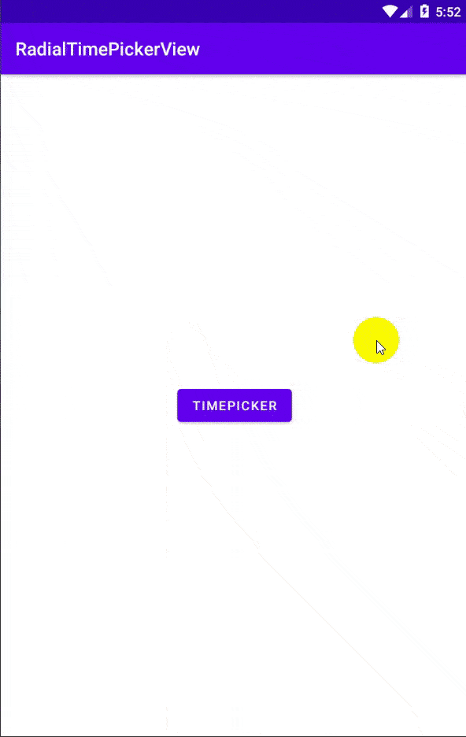

# PersianRadialTimePicker
[](https://opensource.org/licenses/MIT)
[](https://developer.android.com/index.html)
[](https://android-arsenal.com/api?level=19)
[](https://jitpack.io/#osameh15/PersianRadialTimePicker)

This library offers a Radial time picker designed on [Google's Material Design Principals For Pickers](http://www.google.com/design/spec/components/pickers.html) for Android 4.4 (API 19) +.
Persian Radial Time Picker via Bottom sheet design. Developed by [@aliHosseinNezhad](https://github.com/aliHosseinNezhad).
</br>You can customize it in any color and text. we made this very flexible!!



12 Hour | 24 Hour
---- | ----
 | 

You can report any issue on issues page. Note: If you speak Persian, you can submit issues with Persian (Farsi) language and I will check them. :)

## Contents

- [Installation](#installation)
- [How to use](#how-to-use)
- [changing style](#changing-style)
- [Bugs and feedback](#bugs-and-feedback)
- [Credits](#credits)
- [License](#license)

## Installation

#### Setup
- Make sure you are using material components in your default AppTheme i.e your AppTheme inherits from a material theme
- In project-level build.gradle:
```groovy
  allprojects {
  	repositories {
          // ...
          maven { url 'https://jitpack.io' }
      }
  }
```
- In your app-level build.gradle file: 
```
implementation 'com.github.aliHosseinNezhad:PersianRadialTimePicker:1.3.0'
```
## How to use

1. You can use Time Picker in activity or fragment
### Add to layout

    <com.arappmain.radialtimepicker.RadialTimePickerView
                    android:id="@+id/radial_time_picker_2"
                    android:layout_width="0dp"
                    android:layout_height="0dp"
                    app:clock_mode="hour24"
                    app:layout_constraintBottom_toBottomOf="parent"
                    app:layout_constraintDimensionRatio="1:1"
                    app:layout_constraintEnd_toEndOf="parent"
                    app:layout_constraintHorizontal_bias="0.507"
                    app:layout_constraintStart_toStartOf="parent"
                    app:layout_constraintTop_toTopOf="parent"
                    app:layout_constraintWidth_percent="0.85"
                    app:text_typeface="@font/dana_fanu_light" />
 
2. Bottom sheet dialog: Time Picer 
```
private var timePickerBottomSheetFragment = TimePickerBottomSheetFragment()
        timePickerBottomSheetFragment.let {
            it.setOnTimeResultListener { successful, startHour, startMinute, endHour, endMinute ->
                Toast.makeText(this,
                    "$startHour:$startMinute, $endHour:$endMinute",Toast.LENGTH_LONG).show()
            }
            it.show(supportFragmentManager,null)
        }
 ```
 
### changing style
  you can change color of views by the folowing way:
 ```  
 fun darkMode(it: TimePickerBottomSheetFragment) {
        var textColors = Color.rgb(220, 220, 230)
        var secondaryColor = Color.rgb(90, 90, 90)
        it.setTimeCardViewColor(Color.rgb(50, 50, 50))
        it.setBackgroundColor(Color.rgb(50, 50, 50))
        it.setSecondaryColor(Color.rgb(90, 90, 90))
        it.setRadialTimePickerColors(RadialTimePickerColors().also {
            it.textsColors = textColors
            it.clockNumberBackColor = Color.rgb(60, 60, 60)
            it.selectorColor = secondaryColor
            it.selectorTextColor = textColors
            it.clockBackColor = Color.rgb(60, 60, 60)
        })
        it.setTitleColor(textColors)
        it.setTextsColors(textColors)
        it.setTimeTextColors(textColors)
    }
``` 
and change all texts by the folowing method:
``` 
  fun englishMode(it: TimePickerBottomSheetFragment) {
      it.setViewsText {
          it.amText = "am"
          it.pmText = "pm"
          it.acceptText = "ok"
          it.hourText = "hour"
          it.minuteText = "minute"
          it.startTime = "start time"
          it.endTime = "end time"
          return@setViewsText it
      }
  }
 ``` 
 
 
## Bugs and Feedback

For bugs, feature requests, and discussion please use [GitHub Issues](https://github.com/osameh15/PersianRadialTimePicker/issues)

## Credits

This library was inspired by this repos:

- https://github.com/wdullaer/MaterialDateTimePicker
- https://github.com/ashiqursuperfly/Android-Material-Ranged-Time-Picker-Dialog

## License
```
MIT License

Copyright (c) 2021 osameh irandoust

Permission is hereby granted, free of charge, to any person obtaining a copy
of this software and associated documentation files (the "Software"), to deal
in the Software without restriction, including without limitation the rights
to use, copy, modify, merge, publish, distribute, sublicense, and/or sell
copies of the Software, and to permit persons to whom the Software is
furnished to do so, subject to the following conditions:

The above copyright notice and this permission notice shall be included in all
copies or substantial portions of the Software.

THE SOFTWARE IS PROVIDED "AS IS", WITHOUT WARRANTY OF ANY KIND, EXPRESS OR
IMPLIED, INCLUDING BUT NOT LIMITED TO THE WARRANTIES OF MERCHANTABILITY,
FITNESS FOR A PARTICULAR PURPOSE AND NONINFRINGEMENT. IN NO EVENT SHALL THE
AUTHORS OR COPYRIGHT HOLDERS BE LIABLE FOR ANY CLAIM, DAMAGES OR OTHER
LIABILITY, WHETHER IN AN ACTION OF CONTRACT, TORT OR OTHERWISE, ARISING FROM,
OUT OF OR IN CONNECTION WITH THE SOFTWARE OR THE USE OR OTHER DEALINGS IN THE
SOFTWARE.
```
